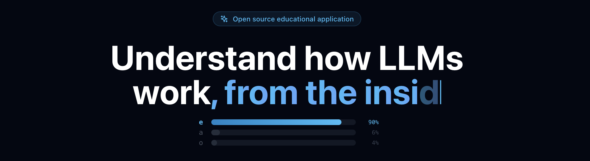

# Noesis

<p align="center">
  
</p>

An interactive educational application to learn how Large Language Models (LLMs) work. Built from scratch with a NumPy-based LLM engine, Django backend, and React frontend.

## Features

- **Educational Pipeline**: Step-by-step explanations of tokenization, embeddings, attention, feed-forward layers, backpropagation, and more
- **Interactive Playground**: Train small models on your own data and observe the training process in real-time
- **LLM Engine from Scratch**: Pure NumPy implementation with autograd, Adam optimizer, and transformer architecture
- **Visualizations**: Attention heatmaps, token grids, loss curves, and weight matrices

## Architecture

```
noesis/
├── modules/          # LLM engine (NumPy) — tokenizer, attention, transformer blocks
├── autograd/         # Backpropagation engine
├── optim/            # Adam & SGD optimizers
├── training/         # Data loader, trainer, LR scheduler
├── config.py         # Model configuration
├── backend/          # Django REST + WebSocket (Channels/Daphne)
│   ├── api/views/    # REST endpoints
│   ├── api/services/ # EngineService, TrainingService
│   └── api/models.py # ModelConfig, TrainingData, TrainingRun
├── frontend/         # React 18 + TypeScript + Vite + Tailwind
│   └── src/
│       ├── pages/    # Educational pages + playground
│       ├── components/
│       ├── stores/   # Zustand state management
│       └── api/     # Axios client
└── docker-compose.yml
```

## Prerequisites

- Docker & Docker Compose
- Node.js 18+ (for local frontend development)
- Python 3.11+ (for local backend development)

## Quick Start

### Using Docker (recommended)

```bash
# Start all services (Redis, backend, frontend)
docker compose up

# Access the app at http://localhost:5173
# API at http://localhost:8001
```

### Local development

**Backend:**
```bash
# Create virtual environment
python -m venv venv
source venv/bin/activate  # or `venv\Scripts\activate` on Windows

# Install dependencies
pip install -r backend/requirements.txt

# Set up database
cd backend && python manage.py migrate
python manage.py seed_presets

# Run server (from project root with PYTHONPATH)
PYTHONPATH=. python manage.py runserver 8000
# Or with Daphne for WebSocket support:
daphne -b 0.0.0.0 -p 8000 backend.asgi:application
```

**Frontend:**
```bash
cd frontend
npm install
npm run dev
# Dev server at http://localhost:5173
```

**Redis** (required for WebSocket):
```bash
docker run -p 6379:6379 redis:7-alpine
```

## Commands

| Command | Description |
|---------|-------------|
| `docker compose up` | Start all services |
| `cd frontend && npm run dev` | Frontend dev server |
| `cd frontend && npm run build` | Production build |
| `cd frontend && npm run test` | Run Vitest tests |
| `cd backend && python manage.py migrate` | Run migrations |
| `cd backend && python manage.py seed_presets` | Seed preset models |
| `docker compose --profile test run test` | Run pytest |

## License

This project is licensed under the GNU General Public License v3.0 - see the [LICENSE](LICENSE) file for details.

## Contributing

Contributions are welcome! Please read [CONTRIBUTING.md](CONTRIBUTING.md) for guidelines and [CODE_OF_CONDUCT.md](CODE_OF_CONDUCT.md) for community standards.
